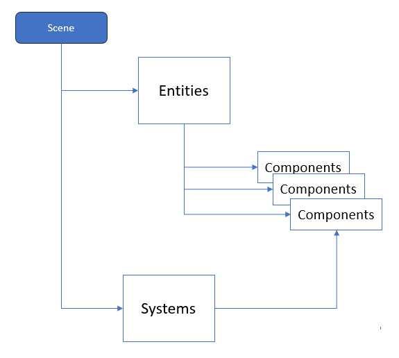

# Demo 3

## ECS and Multiplayer Demo

## Multiplayer Interface - Hathora

Squeleto has native support for interfacing to [Hathora Cloud](https://hathora.dev/) which is a fully managed hosting platform for
multiplayer game servers. Upload your game server and instantly have access to 10 regions around the world. Fun!

[Hathora Docs](https://hathora.dev/docs)

[Hathora API's](https://hathora.dev/api)

When you want to leverage the Hathora Interface, there is a library module: [Multiplayer.ts](./multiplayer.md)

This interface allows you to connect to an application you create on Hathora Cloud. You can run this server locally for debug, you can
host this server yourself, or you can push a docker image of your server to Hathora Cloud.

## Scenes

There are two scenes in Demo3, the Lobby, which uses the Hathora Lobby Service to manage/create/join open games, or to create private
games.

When a legit game is joined, the Lobby passes the network client interface into the Game Scene which then gets the server updates for
player position and direction.

## ECS

This is also the tutuorial demo for the new Squeleto [ECS](./ECS.md) framework.

The ecs is comprised of Scenes, which posses entities, those entities posses components (properties), and thos components are
manipulated by systems.

A good example, is a player entity can have position and velocity components attached to them. The movement system uses the velocity
component and modifies the position component of that entity.

### Demo Features:

- [Scenes](./ECS.md)
- [Entities](./ECS.md)
- [Components](./ECS.md)
- [Systems](./ECS.md)
- [Multiplayer](./multiplayer.md)
