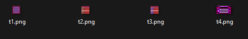

# Level Editor

## Approach




The objective of the level editor was to be able to provide the CreateMap() method in the scene the ability to pass a edited tilemap level.

The map would be created from either discrete tiles, or a tileset. The configuration and spacing of that level could be passed through a series of ascii characters representing the tiles.

Then one would simply need the ascii representation of the level, and the mapping of the tiles to those ascii characters.

### Definitions

There are several exported types here:

```ts
export type TileConfig = {
  src: HTMLImageElement;
  tileWidth: number;
  tileHeight: number;
  offsetX?: number;
  offsetY?: number;
};

export type TileSetConfig = {
  src: HTMLImageElement;
  tileSetWidth: number;
  tileSetHeight: number;
  rows: number;
  cols: number;
};

export type TileMapConfig = {
  template: Array<string>;
  tileSize: number;
  rows: number;
  cols: number;
};
```

### Classes

- Tile class
- TileSet class

  These two classes are very similar, and have no methods, so they are just a collection of properties.

```ts
class Tile {
  constructor(config: TileConfig) {}
}

class TileSet {
  constructor(config: TileSetConfig) {}
}
```

- TileMap class

```ts
class TileMap {
  constructor(config: TileMapConfig) {}
}
```

## Usage

So for the game content, the intent for a tilmap to be created as its own class extending TileMap. This then can be used in the Map content when its defined.
....THEN... in the scene when the maps our loaded, those map objects are created as normal.

Let's role play this a bit...

```ts
//****************************************************************************************
// ./src/TileMap/myTilemap.ts
//****************************************************************************************
import {Assets} from "@peasy-lib/peasy-assets";

export class myTileMap extends TileMap {
     let map = [
      "#                      #",
      "#  =                =  #",
      "#       =       =      #",
      "#           =          #",
      "#                      #",
      "#       =       =      #",
      "#                      #",
      "#    =      =       =  #",
      "#                      #",
      "0@0@0@0@0@0@0@0@0@0@0@0@"];

    //setup tilemap configuration
    let config: TileMapConfig = {
      template: map,
      tileSize: 16,
      rows: 10,
      cols: 24,
    };
    super(config);
    //set background
    this.backgroundImage = Assets.image("mybgnd");

    let tilesetConfig: TileSetConfig = {
      src: Assets.image("mytiles"),
      tileSetWidth: 80,
      tileSetHeight: 16,
      rows: 1,
      cols: 5,
    };
    let myTileset = new TileSet(tilesetConfig);
    //Load TileSet
    let TileT1 = new Tile({ src: myTileset.src, tileWidth: 16, tileHeight: 16, offsetX: 0, offsetY: 0 });
    let TileT2 = new Tile({ src: myTileset.src, tileWidth: 16, tileHeight: 16, offsetX: 16, offsetY: 0 });
    let TileT3 = new Tile({ src: myTileset.src, tileWidth: 16, tileHeight: 16, offsetX: 32, offsetY: 0 });
    let TileT4 = new Tile({ src: myTileset.src, tileWidth: 32, tileHeight: 16, offsetX: 48, offsetY: 0 });

    //Assign Tiles
    let assignmentMap = new Map<string, { tile: Tile; wall: boolean }>();
    assignmentMap.set("#", { tile: TileT1, wall: true }); //wall
    assignmentMap.set("0", { tile: TileT2, wall: true }); //brick1
    assignmentMap.set("@", { tile: TileT3, wall: true }); //brick2
    assignmentMap.set("=", { tile: TileT4, wall: true }); //platform*/
    this.setTileMapConfig(assignmentMap);
    this.initialize();
  }
}
```

```ts
//****************************************************************************************
//  ./src/Maps/myMap.ts
//****************************************************************************************
import {myTileMap} from "./Tileset/myTileMap"
export class myMap extends GameMap {
  constructor(assets: any) {
    let config: MapConfig = {
      name: "myMap",
      width: 256,
      height: 288,
      layers: [new myTileMap().tileMapImage],
    }
...
```

```ts
//****************************************************************************************
// ./src/Scenes/myScene.ts
//****************************************************************************************
import { myMap } from "./src/Maps/myMap";

//Load Maps
this.renderer.createMap([new MyMap()]);
this.renderer.changeMap("myMap");
```

## Tiles vs TileSets

There is one difference between using individual Tiles and one Tileset to make your TileMap work, and that's the optional offset parameters when you define the Tiles as well as the source changes.

```ts
//Load TileSet
let TileT1 = new Tile({ src: myTileset.src, tileWidth: 16, tileHeight: 16, offsetX: 0, offsetY: 0 });
let TileT2 = new Tile({ src: myTileset.src, tileWidth: 16, tileHeight: 16, offsetX: 16, offsetY: 0 });
let TileT3 = new Tile({ src: myTileset.src, tileWidth: 16, tileHeight: 16, offsetX: 32, offsetY: 0 });
let TileT4 = new Tile({ src: myTileset.src, tileWidth: 32, tileHeight: 16, offsetX: 48, offsetY: 0 });

//Load Tiles
let TileT1 = new Tile({ src: tile1.src, tileWidth: 16, tileHeight: 16 });
let TileT2 = new Tile({ src: tile2.src, tileWidth: 16, tileHeight: 16 });
let TileT3 = new Tile({ src: tile3.src, tileWidth: 16, tileHeight: 16 });
let TileT4 = new Tile({ src: tile4.src, tileWidth: 32, tileHeight: 16 });
```
