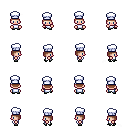

# SpriteSheets and Animations

There is two parts to this library class. The spritesheet class contains two classes, SpriteSheet and AnimationSequence.



## SpriteSheets

Spritesheets are manage slightly differently than sprites. This is the fact that we have to initialize the spritesheet class prior to passing the sprite layers to the GameObject config.

In Demo 1, under Player.ts GameObject, we can see the above spritesheet initialized in this manner.

```ts
let heroSpritesheet = new Spritesheet(assets.image("hero").src, 16, 4, 4, 32, 32);
heroSpritesheet.initialize();
```

Again, this is done prior to the game object initialization, because this spritesheet object will be passed as one of the sprite layers when you configure the Game Object.

The parameters of the `new Spritesheet()` method is:

- passing the peasy-asset image reference
- number of frames
- number of rows
- number of cols
- frame Width (px)
- frame Height (px)

After you have the spritesheet object returned, you must call the `initialize()` method next to setup the class frame dimensions which are autocalculated.

## Animation Sequence

The animation magic is what happens next.

Using the animation sequence class:

```ts
animationHandler; //defined the property in the class

//setup the different animation sequences, with sequence name,mapped to the frame numbers associated
//with that sequence
demosequence = {
    "walk-up": [8, 9, 10, 11],
    "walk-down": [0, 1, 2, 3],
    "walk-left": [12, 13, 14, 15],
    "walk-right": [4, 5, 6, 7],
    "idle-down": [0],
    "idle-up": [8],
    "idle-left": [12],
    "idle-right": [4],
  };

//setup the animation handler for the GameObject, and set initial sequnce
this.animationHandler = new AnimationSequence(heroSpritesheet, this.animationUpdate, _
this.demosequence, 150);
this.animationHandler.changeSequence("idle-down");

/***********************************
* update callback for the
* animation handler
************************************/
  animationUpdate = () => (this.spriteLayers[1].animationBinding = _
  this.animationHandler.getFrameDetails());
```

The parameters associated with the `new AnimationSequence()` call is:

- spritesheet object
- callback routine that is called
- the sequences that can be executed by this sequence
- the amount of time between each call in millisceconds

The callback that is called on the animation schedule is responsbile for grabbing the correct frame data from the sequence, and then assigning that data to the animation binding that exists on the appropriate spriteLayer.

This ultimately is responsible for moving the background-position property for that sprite layer, displaying the correct sequence frame on schedule.
