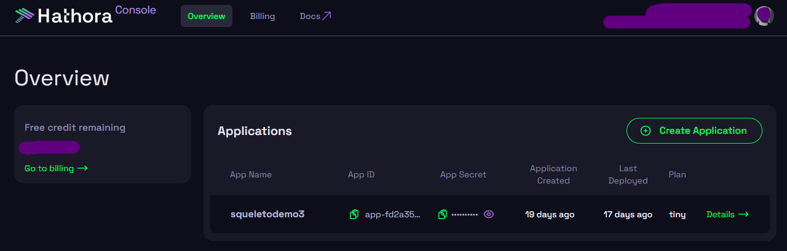
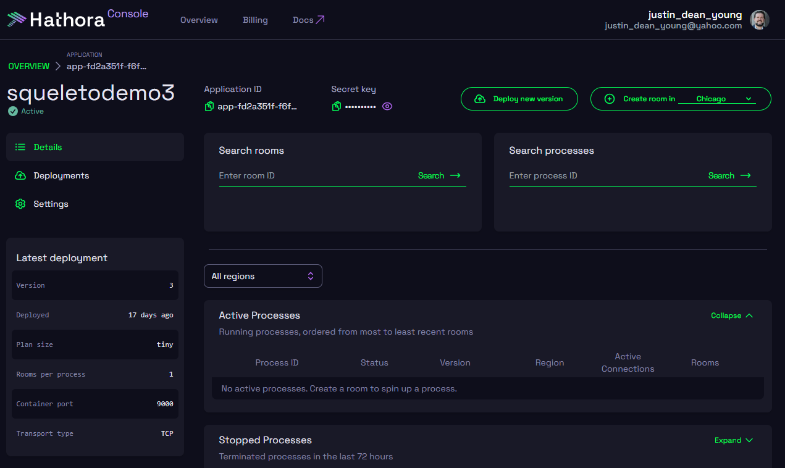

# Multiplayer Interface

## Hathora

### Hathora Console

[Link: Hathora Console](https://console.hathora.dev/login)

Hathora console is where you can manage your different applications that you have created in the cloud. Drilling into each application
provides the critical information for connecting to that server.



Within each application screen:



You can retreive your appID and Secret key for your environment variables.

### Hathora CLI

[Link: Hathora CLI Github](https://github.com/hathora/cli)

The hathora cli is a utility for interacting with the hathora api to create and manage hathora projects.

```shell
npm i -g @hathora/cli
```

common uses:

```shell
hathora-cloud deploy --appId $APP_ID --token $HATHORA_TOKEN
hathora-cloud login
...
```

Please review the Hathora Documentation for comoplete list of commands.

## Environment Variables

Your .env file shoudl exist in your root directory of your project. If you created your project from the Squeleto CLI, then its placed
in the /src/Server diretory for you to find and move. There are three keys of the .env file that will need updated for Hathora to
connect to your server and client.

```shell
HATHORA_APP_SECRET="this comes from Hathor Console when you create your app"
DEV_TOKEN="retrieve this from Hathora CLI"
HATHORA_APP_ID="this comes from Hathora Console when you create your app"
```

## Squeleto Client

### Authentication Client API

This uses the Hathora [AuthV1Api](https://hathora.dev/api#tag/AuthV1) which gives you access to their native methods:

- LoginAnonymous
- LoginNickName
- LoginGoogle

### Lobby Client API

This uses the Hathora [LobbyV2Api](https://hathora.dev/api#tag/LobbyV2) which gives you access to their native methods:

- ListActivePublicLobbies
- GetLobbyInfo
- SetLobbyState

### Room Client API

This uses the Hathora [RoomV2Api](https://hathora.dev/api#tag/RoomV2) which gives you access to their native methods:

- createRoom
- GetRoomInfo
- DestroyRoom
- GetConnectionInfo
- ... and others

### Methods of the Squeleto Multiplayer Interface class

- login()

  - no parameters needed
  - asynchronous method that logs into the Hathora Lobby AuthClient as anonymouse (ATM), other methods to be added later
  - returns the User data which includes:

```ts
export type User = {
  token?: string;
  userdata?: UserData;
};

export type UserData = object & {
  id: string;
  type?: string;
  name?: string;
  iat?: number;
};
```

- getPublicLobbies()

  - no parameters needed
  - asyncronous method that returns an array of active lobbies tied to this server. This only works when the server is hosted on the
    cloud

- createRoom()

  - asynchronous method
  - takes three parameters (Gamescope, Region and configuration)

  - Gamescope:

    ```ts
    export type GameScope = "public" | "private" | "local";
    ```

  - Region:string - imported type from hathora-cloud
  - Config: this is an object passed as default LobbyState

    - ex: `{capacity: 3, numPlayers: 0, lengthOfMatch: 4}`

  - returns the RoomID for this created Room(string)

- sendMessage()

  - asynchronous method that stringifies the type and data and sends to server
  - takes type: string and data string as inputs
  - no return value

- enterRoom()

  - asynchronous method
  - takes the roomID string as input parmeter, establishes the connection with server, and connects client with that room instance
  - no return value

- leaveRoom()

  - asynchronous method
  - disconnects client from current room
  - returns nothing
  - allows client to enter a different room at this time

- getRoomInfo()

  - asynchronous method
  - no input parameters
  - using the currently set active room, returns the Lobby room details for that room

- setRoomID()

- sets the local this.roomID to the passed RoomID string

- changeServerScope()

## Squeleto Server

The default server setup uses the Hathora/server-sdk.

### Package.json

It is helpful to make sure that package.json has an additional script added to it to handle running the server.

```json
"scripts": {
    "build": "vite build",
    "dev": "vite",
    "preview": "vite preview",
    "server": "ts-node --esm ./src/Server/server.ts"
  },
```

This can be ran in a separate command line, or from an additional Powershell instance in VScode.

### Server Application

The Hathora Server has 4 primary functions: - verifyToken - subscribeUser - unsubscribeUser - onMessage

#### Token Verification

This utilizes the verifyJwt method imported form Hathora Server SDK, and uses the env variables to connect and authenticate user with
Hathora.

#### on user connection

This runs when a user sucessfully authenticates to Hathora and joins a room. This is where new rooms can be created, and players can be
added to new/existing rooms. This is where LobbyState can be updated, and any rules around who can enter a room can be qualified prior
to adding them to the room.

    for example: cap on # of players in room at any time

#### on user leaving

This runs when a user disconnects from room either via Server error or when they leave voluntarily.

#### receiving messages

When a connected client runs sendMessage() and sends data to the server, this method is called, and provides the room, the user, and
the message.

#### sending messages

There are two methods that can be leveraged:

- broadcast
- user specific

##### Broadcast

```ts
const joinMessage: ServerJoinMessage = {
  type: "newUser",
  player: newPlayer,
};
server.broadcastMessage(roomId, encoder.encode(JSON.stringify(joinMessage)));
```

##### Direct Message

```ts
const errorMessage: ServerErrorMessage = {
  type: "serverError",
  errormessage: "invalid message type recevied from client",
};
server.sendMessage(roomId, userId, encoder.encode(JSON.stringify(errorMessage)));
```

## Lobby State (optional)

Lobby state is for managing the unique state of data that the 'Lobby' displays when Players are looking to do matchmaking.

- Lobby state is defined for each room when its created (client)
  - this is the initial config passed to the client interface when createRoom() is called
- Lobby state is updated by the server
  - setLobbyState() can be called when the server needs to update the room data displayed and managed by the LobbyService
  ```ts
  return await lobbyClient.setLobbyState(
    process.env.HATHORA_APP_ID as string,
    roomID,
    { state: lobbyState },
    { headers: { Authorization: `Bearer ${process.env.DEV_TOKEN}`, "Content-Type": "application/json" } }
  );
  ```
  - this method requires a DEV_Token in the .env file to use
