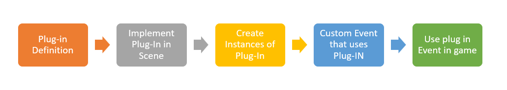

# Custom Plug-Ins

## Approach

The intent and purpose of the custom plug in is to create a sense of extensibility of Squeleto and to allow others to write functional modules of code that can either be shared or adopted entirely into the library.

## Location


PlugIns can be stored in the plugin folder located under the project source.

## Usage

This will outline the overall workflow that we are demonstrating... this is not the only way to use this, but its A way...



### Definition of PlugIn

PlugIns are defined in the plugin directory, as pointed out above. In Demo 1, you can refer to the DialogueManager.ts file as an example of how to do this.

the template property of the plugin is critical for UI dependant plugins, as this is what peasy-UI will render to the screen.

In that template, one can create custom <style></style> tag properties of their UI elements for custom styling

This is the meet of the dialog PlugIn UI elements, there is a bit of custom style tags to go with this to customize these elements.

```ts
`<dialog-container \${===dm.isDialogActive} >
      <dialog-inner \${!==dm.isTransitionActive}>
          <avatar-portrait \${===dm.isLeftVisible} style="background-image: url(\${dm.portraitLeft}); background-size: cover;"></avatar-portrait>
          <avatar-portrait2 \${===dm.isRightVisible} style="background-image: url(\${dm.portraitRight}); background-size: cover;" ></avatar-portrait2>
          <dialog-content \${===dm.isContentVisible}>\${dm.dialogContent}</dialog-content>
          <dialog-choice1 data-index="0" \${===dm.isChoice1Enabled} \${click@=>dm.selectOption}>\${dm.choice1Content}</dialog-choice1>
          <dialog-choice2 data-index="1" \${===dm.isChoice2Enabled} \${click@=>dm.selectOption}>\${dm.choice2Content}</dialog-choice2>
          <dialog-choice3 data-index="2" \${===dm.isChoice3Enabled} \${click@=>dm.selectOption}>\${dm.choice3Content}</dialog-choice3>
          <dialog-submit \${click@=>dm.runNext} \${===dm.isSubmitEnabled}><div>\${dm.submitText}</div></dialog-submit>
      </dialog-inner>
  </dialog-container>`;
```

### Implementing in scene

In the Demo 1, in the game scene, the DialogueManager is a custom plug in... let's start from its game scene implementation and work our way back...

```ts
import { DialogManager } from "../PlugIns/DialogueManager";

//****************************************** */
//dm name here is critical for peasy bindings
//when using plugins, be very careful how you access them
//****************************************** */
dm = new DialogManager();  // this creates the UI state property for the custom plug in

/**
* plug-ins are inserted after the renderer
*/
public template = `<scene-layer class="scene" style="width: 100%; height: 100%; position: absolute; top: 0; left:0; color: white;">
    ${this.renderer.template}
    ${this.dm.template}
</scene-layer>`;

```

2 notes here:

- the dm property in the scene is important in the sense that when i go to use the plugin, that specific property is to be referenced.
- the dm.template is injected into the scene-layer DOM element AFTER the renderer, that way the dialogue box renders on top of the game Camera

### Instances of PlugIns as Content

After the fundamental plugin system is created, then a user can create their own content folders for their plugins to create instances of their PlugIn.

For Demo 1, under we created `bookcasepopup.ts` and `testConversation.ts` to exercise our custom PlugIn.

This shows how the types and classes from your custom plugin can be pulled in and used.

```ts
//bookcasepopup.ts
import { Conversation, DialogSnapshot } from "../PlugIns/DialogueManager";
import { GameObject } from "../../src/components/GameObject";

const snapshot1: DialogSnapshot = {
  conditions: {
    metBookcase: false,
  },
  content: [
    { type: "none", speed: 70, message: "just a boring bookcase!!! ", avatar: [], end: true, flags: { metBookcase: true } },
  ],
};
const snapshot2: DialogSnapshot = {
  conditions: {
    metBookcase: true,
  },
  content: [{ type: "none", speed: 70, message: "still a boring bookcase ", avatar: [], end: true }],
};

export class bookcasePopup extends Conversation {
  constructor(who: GameObject) {
    super(who);
    this.who = who;
    this.messageSnapshots = [snapshot1, snapshot2];
  }
}
```

### Creating the events

If so desired, a custom game event can be created as well, also demonstrated in this same plugin

```ts
export class DialogEvent extends GameEvent {
  who: GameObject | undefined;
  message: Conversation;
  dm: any;
  resolution: ((value: void | PromiseLike<void>) => void) | undefined;

  constructor(message: Conversation, dm: DialogManager, sf: any) {
    super("dialog");
    this.who = undefined;
    this.message = message;
    this.dm = dm;
    (this.dm as DialogManager).configureStoryFlags(sf);
  }

  init(who: GameObject): Promise<void> {
    return new Promise(resolve => {
      this.who = who;
      document.addEventListener("dialogComplete", this.completeHandler);
      this.resolution = resolve;
      this.dm.configureNarrative(this.message);
      this.dm.runNarrative();
    });
  }

  completeHandler = (e: any) => {
    if ("isCutscenePlaying" in e.detail) {
      e.detail.isCutscenePlaying = false;
    }
    document.removeEventListener("dialogComplete", this.completeHandler);
    if (this.resolution) this.resolution();
  };
}
```

### Using the Events in game

So after these instances and events are created, you have to use them in your game, right?

```ts
//excerpt from Bookshelf.ts, under GameObjects

import { DialogManager } from "../PlugIns/DialogueManager";
import { bookcasePopup } from "../Dialogue/bookcasepopup";
import { DialogEvent } from "../Events/dialogue";

export class Bookshelf extends GameObject {
  dm;
  constructor(assets: any, StoryFlags: StoryFlagManager, dm: DialogManager) {
    ...
    super(config);
    this.dm = dm;
    this.SM = StoryFlags;
    this.interactionEvents = [
      { conditions: { metBookcase: false }, content: [new DialogEvent(new bookcasePopup(this), this.dm, this.SM)] },
      { conditions: { metBookcase: true }, content: [new DialogEvent(new bookcasePopup(this), this.dm, this.SM)] },
    ];
    ...
  }
```
